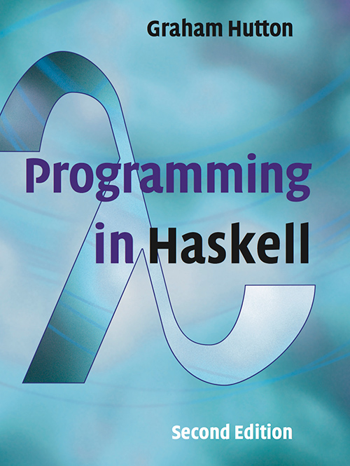

## Programming in Haskell by Graham Hutton

> Functional programming can be viewed as a _style_ of programming in which the basic method of computation is the **application of functions to arguments**. A functional programming language is one that _supports_ and _encourages_ the functional style.
>
> Programming languages in which the basic method of computation is **changing of stored values** are called _imperative_ languages, because programs in such languages are constructed from imperative instructions.

Personal code while reading [Programming in Haskell](https://www.amazon.com/Programming-Haskell-Graham-Hutton/dp/1316626229).

---
[Sean Omlor](http://seanomlor.com)
